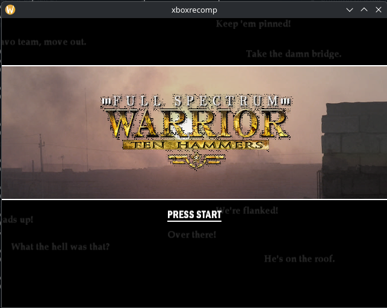
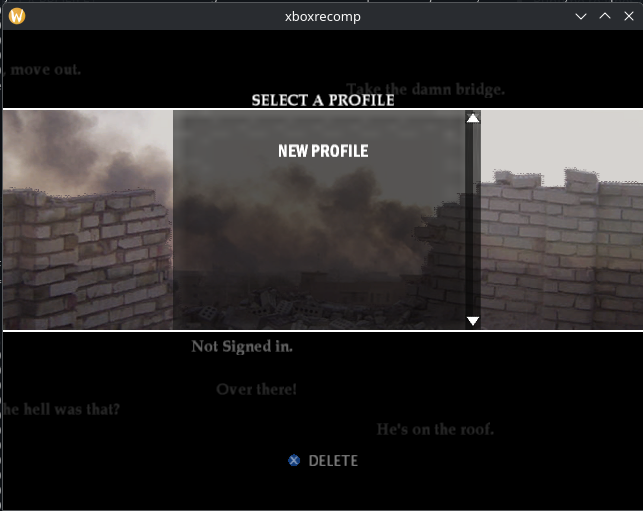
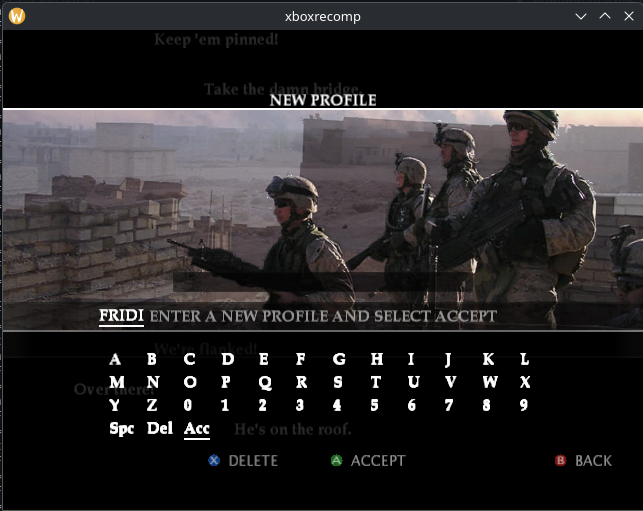
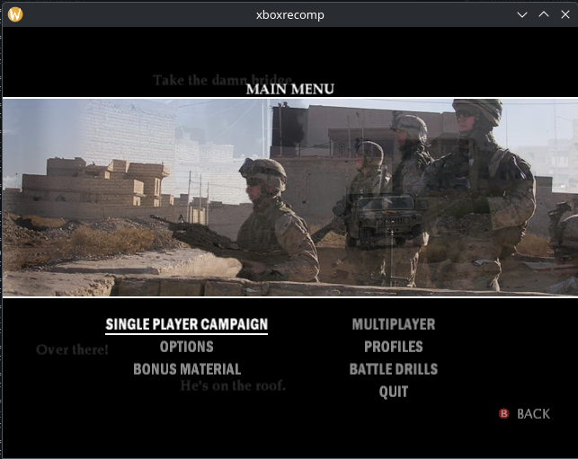
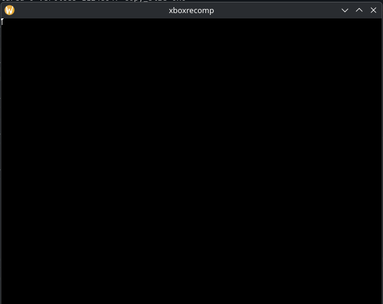

# Full Spectrum Warrior: Ten Hammers - Xbox Static Recompilation

> **A native Linux bring-up of the original Xbox build using the xboxrecompforlinux runtime.**

This project recompiles the original Xbox executable for **Full Spectrum Warrior: Ten Hammers** into a native Linux binary. Game files are not included in this repository.

The current bring-up target is a **review copy build dated Dec 5 2005** because it is symbol rich. Its PDB and MAP data let us recover meaningful function names and a source-like tree. If the port reaches a useful playable state, the plan is to evaluate moving to a retail `default.xbe` without throwing away the recovered source layout, runtime work, or game-specific fixes.

## Current Runtime Screenshots

These captures come from the Linux Vulkan renderer, not mockups.

| Press Start | Profile Select |
|---|---|
|  |  |

| Profile Creation | Main Menu |
|---|---|
|  |  |

The shell/menu screenshots show real `Shell.pak` assets, real menu background layers, real start-menu logo art, real font draws, real profile/menu controls, and the current host-rendered controller glyphs through Vulkan. These are runtime captures from the Linux recomp, not mockups.

| Direct first-level runtime |
|---|
|  |

The first-level screenshot is a real Vulkan frame from the mission loop. It is not playable gameplay yet: the app reaches geometry rendering now, but gameplay flow and textures are not in place yet.

## Current Status

**The Linux port now reaches two important real paths: the shell/profile/main-menu renderer and the first-level geomtry rendering.**

The normal shell path initializes the Vulkan presentation host, loads `Shell.pak`, resolves PAK-contained resources through the game's `ZeroFile` memory-file system, loads `menu.ui`, selects the shell menu, decodes real shell textures, decodes font atlas data, and submits real RHW UI draws through Vulkan. The verified flow now reaches:

```text
Intro Bink videos -> Press Start -> Profile Select -> New Profile -> Profile Creation -> Main Menu
```

The intro Bink videos now resolve from `Shell.pak`, play through the host video path, and can be skipped one at a time. The shell background animation cycle now advances from the real background animation data, the quote text scrolls during shell/profile/main-menu states, the profile creation keyboard renders and accepts input, created profiles route through the original `CProfileManager` add/save path, saved profiles appear on Profile Select across launches, and selecting a saved profile routes into the Main Menu. A host-only `Quit` option has also been added under the Xbox menu options so the Linux build can shut down like a normal PC game.

This shell path is not finished. Profile creation, persistence, profile selection, and Main Menu entry are working, but most Main Menu submenus are not routed correctly yet. Multiplayer is intentionally out of scope for now.

The direct first-level path now loads the current forced mission PAK, registers texture tables, object tables, ABKs, Havok descriptors, fonts, meshes, INI/CSV data, and then enters the live mission loop. A verification run reached `MissionHandler::Update`, `ProcessGame`, `SceneManager_RenderAll`, and more than 3,000 presented Vulkan frames without crashing.

This is not playable yet. The mission path is alive and presenting frames, but world state is still damaged: camera slots, settings, physical world, player/faction lists, and scene object links are frequently invalid, and the visible frame is still dominated by shell/menu background state. The next real gameplay blocker is scene/world population and camera/player state repair, not presentation.

## Since Last Push
- Added more work on actual level paks. Now renders geometry, but gameplay flow and textures are not in place yet. (You just see white lines in the top left of the corner)
- Added and hardened Linux Vulkan D3D8 presentation paths for native RHW UI draws, frame presentation, and runtime frame dumping.
- Advanced the real shell/menu path: `Shell.pak`, `menu.ui`, UI texture lookup, image controls, line controls, static text, font atlas decode, and location-string fallback all run far enough to render the real shell screen.
- Brought up the real shell background animation cycle and quote-text scrolling across Press Start, Profile Select, Profile Creation, and Main Menu states.
- Implemented the Profile Creation keyboard path far enough to render the real keyboard, move selection, enter text, and route to the Main Menu.
- Added a Linux-only `Quit` entry under the Main Menu list and wired it to the application shutdown path for a practical desktop exit.
- Improved selected-item presentation on Profile Creation and Main Menu items, including brighter highlighted text and underline rendering.
- Improved Linux input through SDL/XInput mapping so controller and keyboard fallback paths can drive bring-up.
- Added PAK/memfs/CRC work so resources resolve through the game's real CRC/path flow instead of hardcoded texture substitution.
- Fixed intro Bink playback from PAK-contained `Shell.pak` assets, including one-at-a-time skip behavior.
- Fixed the shell font atlas channel mapping so real menu text renders readable.
- Switched shell background strip rendering to game-computed UVs and allowed inverted image-control UV ranges used by the menu animation data.
- Advanced the real profile path through `Press Start`, `Profile Select`, `New Profile`, `Profile Creation`, saved-profile selection, and `Main Menu`.
- Wired profile persistence through the Linux save bridge so created profiles save under the Linux config/save root and are visible/selectable after relaunch.
- Moved first-level direct mode past earlier setup crashes in PAK loading, object construction, Havok descriptor registration, AI setup, camera update, mission update, and render dispatch.
- Fixed direct mission app-context loss after level setup by clearing bogus pending contexts and restoring the just-entered `MissionHandler` context when generated state clobbers the app manager slots.
- Restored the registered mesh tree when `LoadMesh` finds the live mesh tree root overwritten by invalid data, keeping real mesh CRC lookups alive during level setup.
- Guarded HUD text ticker queues against invalid nodes so HUD setup/update no longer stalls when queue links are corrupted.
- Extended direct-run context restore so the forced mission probe keeps running across frames instead of exiting after the first presented frame.
- Stabilized generated render-cookie construction around clobbered `this`, `ebx`, and ESP state so render setup no longer dies during `XBRenderCookie` construction.
- Added targeted guards and diagnostics across AI, Havok, scene, prop, HUD, particles, sky, sound, script, and manager code so bad generated state is logged and isolated instead of immediately crashing.
- Added updated runtime screenshots under `docs/screenshots/`, including the first-level mission-loop frame.

## What's Working

- **Linux build** - CMake builds `bin/fsw_th_recomp` from the copied xboxrecompforlinux runtime and generated game tree.
- **Source-like generated tree** - PDB source-file records and MAP object names drive the `src/game/fsw/...` layout, with fallback modules under `src/game/external/`.
- **Xbox runtime model** - the recomp runs against an Xbox-style flat memory layout, kernel thunk bridge, heap allocator, XAPI shims, and guest file descriptor table.
- **Linux path handling** - Xbox paths such as `D:\Chapters\Shell.pak` resolve on a case-sensitive Linux filesystem.
- **PAK/memfs loading** - shell and level PAK resources resolve through in-memory PAK tables with relocated data offsets.
- **Real shell drawing** - the current renderer draws real shell textures, readable menu text, profile screens, main menu controls, and animated shell background strips through Vulkan.
- **Intro Bink videos** - shell-contained intro videos resolve from `Shell.pak`, play through the host Bink/video surface path, and support per-video skip input.
- **Shell background animation** - the background image cycle and quote text now continue ticking through Press Start, Profile Select, Profile Creation, and Main Menu.
- **Profile Creation menu** - the real profile creation screen and keyboard render, accept text input, add profiles through the game profile manager, save them through the Linux bridge, and continue into the Main Menu.
- **Profile Select menu** - saved profiles appear in the real Profile Select menu and can be selected to enter the Main Menu.
- **Linux save root** - Xbox `U:\` save data now maps to `$XDG_CONFIG_HOME/FSWTH/saves` or `~/.config/FSWTH/saves`, with `FSW_TH_SAVE_DIR` available for test overrides.
- **Main Menu shell** - the Main Menu renders with real menu options, highlight styling, controller glyphs, and a Linux-only Quit option.
- **SDL input bridge** - SDL-backed XInput compatibility detects and maps modern controllers, with keyboard fallback for bring-up.
- **Scripted input bring-up** - `FSW_TH_INPUT_SCRIPT` can drive repeatable shell/profile tests without manual controller input.
- **Direct mission loop** - Using the env `FSW_TH_LEVEL=PR_ProjectsRidealong FSW_TH_FORCE_SKIP_BOOT_SURFACE=1 FSW_TH_DISABLE_MENU_FALLBACK=1 FSW_TH_NET_STATE=0x3A` reaches the first render. Still need to fix gameplay flow and textures.

## Current Blockers

- [ ] Route the remaining Main Menu submenus. The Main Menu renders and the Quit option works, but most Xbox menu destinations are not correct yet.
- [ ] Route Single Player Campaign into the proper Marching Orders/difficulty/loading flow through the normal shell path.
- [ ] Continue tightening shell/menu transforms and animation timing so every menu state matches the Xbox presentation.
- [ ] Continue polishing Bink/video timing and presentation now that the intro videos play in the real shell timeline.
- [ ] Replace temporary XACT/audio bypasses with a real Xbox audio path after gameplay rendering is further along.
- [ ] Fix first-level world/scene population. The direct path reaches `InitLevel`, `ConstructObjects`, `MissionHandler::Update`, `ProcessGame`, and `SceneManager_RenderAll`, but the visible frame still comes from stale shell/menu state instead of proper level geometry.
- [ ] Reduce noisy bring-up diagnostics once each subsystem is stable enough for public testing.

## Current Findings

| Area | Finding |
|------|---------|
| **Build provenance** | The Dec 5 2005 review copy remains the best bring-up target because the PDB/MAP data gives useful source paths and function names. |
| **Source layout** | PDB DBI source-file records are good enough to reconstruct most game modules under a readable `src/game/fsw/...` tree. |
| **PAK resources** | `Shell.pak` contains shell UI resources and video assets; level PAKs contain object, texture lookups, Havok, mesh, and script-side data. |
| **TEX resources** | `main.tex` contains textures. Those textures are resolved through the PAK/resource lookup path. |
| **CRC/resource lookup** | CRCs are calculated by the game path at runtime; the current work uses those calculated CRCs to resolve loaded PAK resources rather than mapping "CRC X means texture Y" by hand. |
| **Menu rendering** | Real textures, background animation layers, readable fonts, controller glyphs, and menu controls are reaching Vulkan; remaining shell work is submenu routing, timing, and exact selected-item behavior. |
| **Background animation** | The shell background image cycle and scrolling quote text are driven by the real background UI state. |
| **Profile flow** | Press Start now reaches Profile Select, New Profile, Profile Creation, saved-profile selection, and Main Menu. Profile creation calls the original `ProfileExists`/`AddNewProfile` flow and writes save data through the Linux `U:\` save bridge. |
| **PC exit path** | The Xbox shell had no desktop-style Quit item; the Linux fork now adds a practical Quit entry under the Main Menu and routes it to shutdown. |
| **Bink/video** | The intro videos now resolve from `Shell.pak`, play through the host Bink/video surface path, and skip one at a time like the Xbox shell flow. |
| **Render-cookie bug** | Generated code around `XBRenderCookie` construction could clobber `this`, `ebx`, and ESP; targeted repair keeps render-cookie setup alive for now. |
| **App transition bug** | After mission setup and lighting, generated state can clobber `CApplicationManager`'s current/pending slots. The runtime now clears invalid pending contexts and restores the entered `MissionHandler` so the mission loop continues. |
| **Mesh tree bug** | The registered mesh tree root can be overwritten with invalid float-like data such as `3F800000`; `LoadMesh` now restores the snapshotted real tree before lookup. |
| **First-level progress** | Direct mode reaches `MissionHandler::Update`, `ProcessGame`, `SceneManager_RenderAll`, and long-running Vulkan presents. |
| **First-level blocker** | The mission loop is alive, but scene/world state is still incomplete: local player/faction/camera/settings/physical-world data are invalid, and visible output is not proper level geometry yet. |
| **Audio** | XACT wave/sound-bank work is intentionally not the current priority; some paths are bypassed so rendering and gameplay bring-up can continue. |

## How It Works

```text
default.xbe + symbols
    |
    v
PDB/MAP-aware layout tools -> source-like generated tree
    |
    v
x86 -> C static recompilation
    |
    v
CMake + native compiler
    |
    v
Runtime: Xbox memory + kernel bridge + D3D8/Vulkan + SDL input
```

## Target Build

| Field | Value |
|-------|-------|
| **Title** | Full Spectrum Warrior: Ten Hammers |
| **Platform** | Xbox |
| **Current bring-up build** | Review copy |
| **Build date** | Dec 5 2005 |
| **Why this build** | Symbol-rich PDB and MAP data |
| **Generated source files** | 1,458 |
| **Emitted functions** | 46,875 |
| **PDB-style source-tree files** | 1,179 |
| **Fallback external files** | 279 |
| **Game files** | Local only, gitignored |

## Project Structure

```text
FullSpectrumWarriorTHXBOX/
|-- README.md
|-- CMakeLists.txt
|-- docs/
|   |-- screenshots/
|   `-- source-layout.md
|-- include/
|-- src/
|   |-- apu/
|   |-- audio/
|   |-- d3d/
|   |-- game/
|   |   |-- fsw/
|   |   |-- external/
|   |   `-- recomp/
|   |-- input/
|   |-- kernel/
|   |-- nv2a/
|   `-- platform/
|-- templates/
|-- tools/        # local/private helper tools, gitignored
`-- game_files/   # local game files, gitignored
```

## Building

### Linux Prerequisites

- CMake 3.20+
- Python 3.10+
- SDL2 development package
- Vulkan loader and headers
- Original Xbox game files placed locally under `game_files/`

### Linux Build Steps

```bash
cmake -S . -B build/linux -DCMAKE_BUILD_TYPE=RelWithDebInfo
cmake --build build/linux --target fsw_th_recomp -j$(nproc)
```

Run from the repo root:

```bash
bin/fsw_th_recomp game_files/default.xbe game_files
```

Useful bring-up commands:

```bash
# Real shell/menu path
FSW_TH_DISABLE_MENU_FALLBACK=1 bin/fsw_th_recomp

# Isolated save-dir test run
FSW_TH_SAVE_DIR=/tmp/fswth-saves FSW_TH_DISABLE_MENU_FALLBACK=1 bin/fsw_th_recomp

# Direct first-mission probe
FSW_TH_FORCE_DIRECT=1 FSW_TH_DISABLE_MENU_FALLBACK=1 bin/fsw_th_recomp

# Dump a Vulkan frame to /tmp/xboxrecomp_vulkan_frame.ppm
XBOXRECOMP_DUMP_VULKAN_FRAME=120 FSW_TH_DISABLE_MENU_FALLBACK=1 bin/fsw_th_recomp
```
