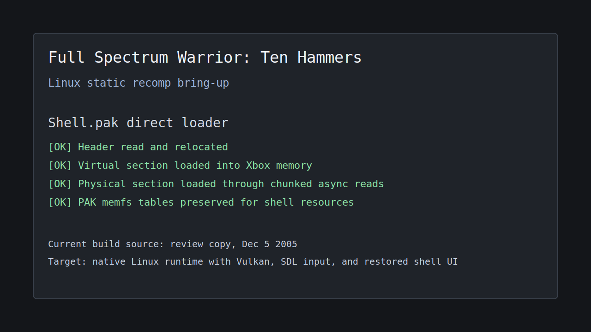
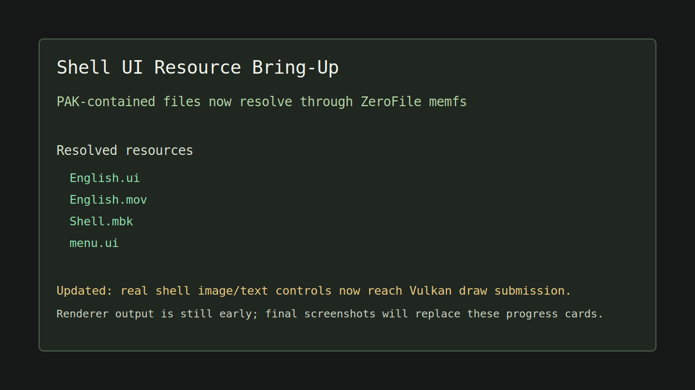
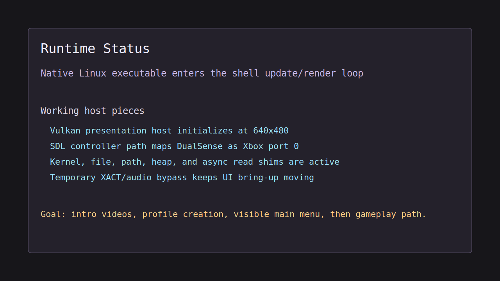

# Full Spectrum Warrior: Ten Hammers - Xbox Static Recompilation

> **A native Linux bring-up of the original Xbox build using the xboxrecompforlinux runtime.**

This project recompiles the original Xbox executable for **Full Spectrum Warrior: Ten Hammers** into a native PC binary. The current work is built from a **review copy build dated Dec 5 2005** because it is unusually symbol rich: it includes PDB and MAP data that let us recover a source-like tree and meaningful function names. Game files are not included in this repository.





## Why This Is Interesting

The review build gives this project a strong reverse-engineering base. PDB source-file records and MAP object names let the generated code be split into a readable tree instead of one anonymous recomp dump. That means game code can live under paths like `src/game/fsw/ui/menusystem/` and `src/game/fsw/main/`, while third-party or SDK-style fallback modules stay under `src/game/external/`.

The current goal is not to preserve the review build forever. It is the best bring-up target because it has symbols. Once the Linux runtime reaches a useful playable state, we may migrate the project to a retail `default.xbe`. The important part is that the recovered source layout, manual runtime fixes, Vulkan work, SDL input, kernel bridges, and game-specific patches can carry forward without throwing away the work done here.

## Current Status

**Linux bring-up: shell runtime reached.** The project builds as `bin/fsw_th_recomp`, initializes the Linux Vulkan presentation host, maps SDL input for a DualSense-style controller, loads `Shell.pak`, resolves PAK-contained shell resources through the game's `ZeroFile` memory-file system, and enters the shell update/render loop.

The renderer is still early. Vulkan initializes and the host loop runs, but the game is not yet drawing a complete visible shell/menu. The menu loader now opens `menu.ui` from the Shell PAK and reaches the controls loader, but menu population currently stops at a missing generated target.

### What's Working

- **Linux build** — CMake builds the native executable with the copied xboxrecompforlinux runtime sources.
- **Source-like generated tree** — PDB source-file records drive the `src/game/fsw/...` layout, with MAP/object fallback for modules without source-file records.
- **Xbox memory/runtime model** — the recompiled code runs against the Xbox-style flat memory layout, kernel thunk bridge, heap allocator, and XAPI shims.
- **Linux file/path handling** — Xbox paths such as `D:\Chapters\Shell.pak` and mixed-case game-file lookups resolve on a case-sensitive Linux filesystem.
- **Chunked async file reads** — the Shell PAK direct loader reads large virtual/physical sections through the Linux kernel bridge and async completion path.
- **Shell PAK loading** — `Shell.pak` header, virtual section, physical section, relocation table, and memory-file tables are loaded and relocated.
- **PAK resource lookup** — `English.ui`, `English.mov`, `Shell.mbk`, and `menu.ui` now resolve through the in-memory PAK file tables.
- **Vulkan host initialization** — the Linux D3D8/Vulkan presentation host starts at 640x480.
- **SDL input path** — SDL-backed XInput compatibility detects and maps a DualSense-style controller to Xbox port 0.
- **Audio bring-up bypasses** — temporary XACT/wave-bank/cue-list bypasses keep shell UI bring-up moving until the real audio backend is ready.

### What's Left

- [ ] Fix the `menu.ui` control parser path; current blocker is missing target `0x00132909`.
- [ ] Replace temporary XACT/audio bypasses with a real Xbox audio path.
- [ ] Connect more of the game's D3D8/NV2A draw submission to the Vulkan backend.
- [ ] Restore intro video playback instead of only resolving video metadata.
- [ ] Reach the first no-profile flow and profile creation menu.
- [ ] Make the shell menu visible and navigable with SDL controller input.
- [ ] Remove or gate noisy bring-up diagnostics before a public release.
- [ ] Evaluate migration from the Dec 5 2005 review XBE to a retail XBE once the port reaches a useful playable state.

## Current Findings

| Area | Finding |
|------|---------|
| **Build provenance** | Current bring-up uses the Dec 5 2005 review copy because its PDB/MAP data is symbol rich. |
| **Source layout** | PDB DBI source-file records are good enough to reconstruct a source-like tree for many game modules. |
| **PAK loader** | `Shell.pak` stores virtual and physical sections plus relocation data; the relocation-table pointer is at `0x60825C`, with count at `0x608260`. |
| **PAK memfs** | PAK memory-file entries need their data offsets relocated to the loaded virtual base before `ZeroFile` can read them. |
| **Menu resources** | `menu.ui` is inside the Shell PAK and now opens from memfs, but parsed controls are not yet being added to the menu manager. |
| **Generated CRT issue** | The generated `strchr` stub was incomplete and caused relative resource paths to be treated as external paths. |
| **Audio issue** | XACT paths currently attempt large wave-bank allocations and sentinel-pointer cue registration; these are bypassed for UI bring-up. |

## How It Works

### The Recompilation Pipeline

```text
default.xbe + symbols
    |
    v
PDB/MAP-aware layout tools -> source-like generated tree
    |
    v
x86 -> C static recompilation
    |
    v
CMake + native compiler
    |
    v
Runtime: Xbox memory + kernel bridge + D3D8/Vulkan + SDL input
```

### Source Layout

The generated recomp source is grouped by original PDB source path where the PDB has DBI source-file data, with MAP linker objects as fallback. For example, `CActivateReport.obj` is emitted as:

```text
src/game/fsw/script/behaviors/scriptbehaviors/cactivatereport.c
```

Modules without PDB source-file records are grouped under `src/game/external`.

## Target Build

| Field | Value |
|-------|-------|
| **Title** | Full Spectrum Warrior: Ten Hammers |
| **Platform** | Xbox (Original) |
| **Current bring-up build** | Review copy |
| **Build date** | Dec 5 2005 |
| **Why this build** | Symbol-rich PDB and MAP data |
| **Generated source files** | 1,458 |
| **Emitted functions** | 46,875 |
| **PDB-style source-tree files** | 1,179 |
| **Fallback external files** | 279 |
| **Game files** | Local only, gitignored |

## Project Structure

```text
FullSpectrumWarriorTHXBOX/
├── README.md
├── CMakeLists.txt
├── docs/
│   ├── screenshots/
│   └── source-layout.md
├── include/
├── src/
│   ├── apu/
│   ├── audio/
│   ├── d3d/
│   ├── game/
│   │   ├── fsw/
│   │   ├── external/
│   │   └── recomp/
│   ├── input/
│   ├── kernel/
│   ├── nv2a/
│   └── platform/
├── templates/
├── tools/        # local/private helper tools, gitignored
└── game_files/   # local game files, gitignored
```

## Building

### Linux Prerequisites

- CMake 3.20+
- Python 3.10+
- SDL2 development package
- Vulkan loader and headers
- Original Xbox game files placed locally under `game_files/`

### Linux Build Steps

```bash
cmake -S . -B build/linux -DCMAKE_BUILD_TYPE=RelWithDebInfo
cmake --build build/linux --target fsw_th_recomp -j$(nproc)
```

Run from the repo root:

```bash
bin/fsw_th_recomp game_files/default.xbe game_files
```

## Development Notes

The current screenshots are progress cards rather than final rendered gameplay captures. They will be replaced with real runtime screenshots once the renderer produces useful intro/menu frames.
